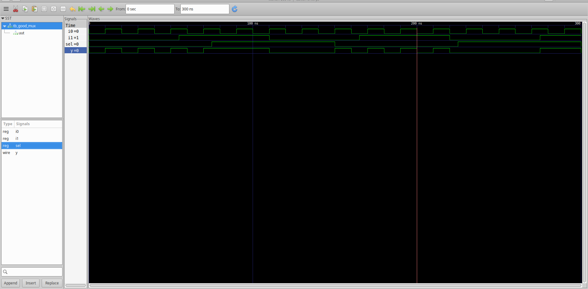

## Design

The `Design` refers to the actual Verilog code (or set of Verilog modules) that implements the intended functionality according to the specified requirements.

---

## Testbench

A `Testbench` is a simulation environment used to apply test vectors (stimulus) to the design in order to verify its functionality.

---

## How the Simulator Works

- The simulator monitors **input signals** for changes.
- When an input **changes**, the simulator evaluates outputs based on the design logic.
- If there is **no input change**, then **no output update** is triggered.
- The simulator reacts only to **input transitions**, not static inputs.

---

## Simulation Flow

Open-source tools used:

- `Icarus Verilog (iverilog)` – Used to compile and simulate Verilog HDL code.
- `GTKWave` – Used to view waveforms from `.vcd` (Value Change Dump) files.


###  Tool Installation

```bash
sudo apt install iverilog
sudo apt install gtkwave
```

###  Compile Design and Testbench

```bash
iverilog -o output.out design.v testbench.v
```

- This creates an executable `output.out`.
- Run the simulation:

```bash
./output.out
```

- It generates a `wave.vcd` file containing signal transitions.

### View Waveform

```bash
gtkwave wave.vcd
```

### Example: Simulation Waveform for 2:1 MUX



---

## Synthesis Flow

- A **synthesizer** converts RTL Verilog code into a **gate-level netlist** using cells from a technology library (`.lib`).
- We use `Yosys` as the synthesis tool.
- The `.lib` file (Standard Cell Library) contains functional, timing, area and power information of logic gates like AND, OR, MUX, INV, DFF, etc.
- The synthesizer maps your logic into these standard cells.

### Timing Constraints

- For a digital circuit to work properly, two key timing constraints need to be satisfied :
  - **Setup Time**
  - **Hold Time**
  

Slower cells are sometimes needed to fix hold time violations.

###  Tool Installation

```bash
sudo apt install yosys
```

---

## Commands to Synthesize the Design using Yosys

```bash
read_liberty -lib sky130_fd_sc_hd__tt_025C_1v80.lib
read_verilog ../verilog_files/good_mux.v
synth -top good_mux
abc -liberty sky130_fd_sc_hd__tt_025C_1v80.lib
show
write_verilog -noattr good_mux_netlist.v
```

###  Command Summary

- ``read_liberty -lib``  
  Loads the Sky130 standard cell library.

- ``read_verilog``  
  Loads your RTL Verilog code.

- ``synth -top good_mux``  
  Performs synthesis; `good_mux` is set as the top module.

- ``abc -liberty``  
  Maps synthesized logic to standard cells from the Sky130 library.

- ``show``  
  Displays a schematic of the synthesized circuit (optional).

- ``write_verilog -noattr``  
  Exports the final gate-level netlist without extra attributes.

---

## Synthesized Schematic: 2:1 MUX


---

##  Resources

All design and testbench files are available in the [repository](https://github.com/kunalg123/sky130RTLDesignAndSynthesisWorkshop.git).
