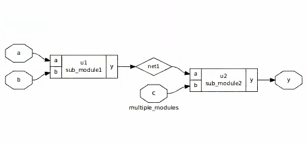
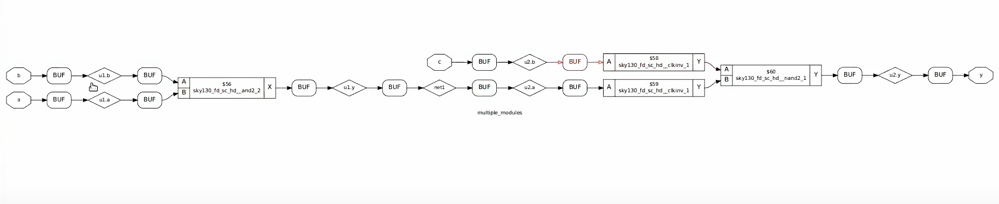
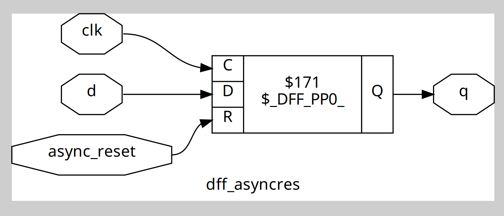
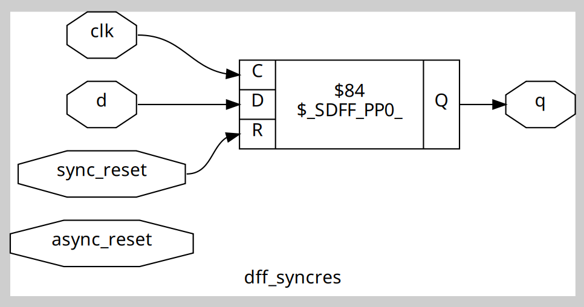
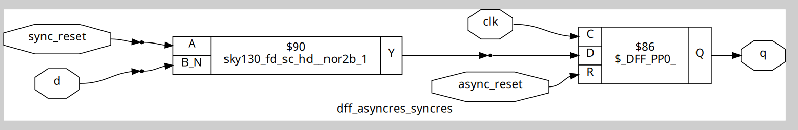

## Timing Libraries

The `.lib` timing library describes the functional, timing, power and area information of standard cells used during synthesis.

The timing library used here is `sky130_fd_sc_hd__tt_025C_1v80.lib`.

-  tt stands for Typical Corner.

**Process corners** describe the range of possible variations in the fabrication process — like how fast or slow transistors switch, depending on tiny variations in doping, dimensions or temperature.

The main standard corners are :

TT (Typical-Typical): Nominal transistor speed.

FF (Fast-Fast): Transistors are faster than nominal.

SS (Slow-Slow): Transistors are slower than nominal.

FS / SF: Mixed — NMOS fast, PMOS slow or vice versa.

### Semiconductor chips are designed and tested to function under various PVT conditions to handle real-world situations.
P — Process ,
V — Voltage , 
T — Temperature

- **025C** means it’s characterized for 25°C,

- **1v80** means a supply voltage of 1.8V.

## Types of Synthesis

### Hierarchical Synthesis
It keeps the module hierarchy intact, just like the RTL design . Each module is synthesized separately and sub-modules are retained as blocks.


### Flattened Synthesis

All modules merged into one netlist for better area and power optimization across modules. It is harder to debug.

`flatten` is the command to do flat synthesis.

Hierarchical synthesis is done for large, modular SoCs, IP-based flows or when reusing verified blocks.

Flattened synthesis is done for maximum performance/area optimization, for small but speed-critical blocks.
- Example :
### Hierarchical Synthesis of multiple_modules.v : 


### Flattened Synthesis of multiple_modules.v :

### Glitches in combinational circuits :
In combinational logic:

- Outputs depend on propagation delays through gates.
When inputs change, different paths may have different delays.

- This can cause temporary incorrect outputs (glitches or hazards) before the final stable output settles.

- When Flip-flops are used between combinational circuits it only capture stable values at edge.
Glitches that occur while signals are settling don’t matter .
## Flip-Flop Coding Styles

### Asynchronous Reset D Flip-Flop

```verilog
module dff_asyncres (input clk, input async_reset, input d, output reg q);
  always @(posedge clk or posedge async_reset)
    if (async_reset)
      q <= 1'b0;
    else
      q <= d;
endmodule
```


This is a D Flip-Flop with an asynchronous reset.

always @(posedge clk or posedge async_reset) means the always block triggers on either:

- the rising edge of the clock (posedge clk), or

- the rising edge of the async reset signal (posedge async_reset).

If async_reset is asserted (1), q is immediately reset to 0, regardless of the clock.

If async_reset is not asserted, the flip-flop samples input d on the rising clock edge and stores it in q.
### Synchronous Reset D Flip-Flop

```verilog
module dff_syncres (input clk, input sync_reset, input d, output reg q);
  always @(posedge clk)
    if (sync_reset)
      q <= 1'b0;
    else
      q <= d;
endmodule
```

This D Flip-Flop has a synchronous reset.

The always block is only sensitive to posedge clk.

- On the rising edge of the clock.

If sync_reset is 1, q is cleared to 0.

- Otherwise, q takes the value of d.
### Synchronous & Asynchronous Reset D Flip-Flop
```verilog
module dff_asyncres_syncres (input clk,input async_reset,input sync_reset,input d,output reg q);
always @(posedge clk or posedge async_reset)
begin
  if (async_reset)
    q <= 1'b0;      
  else if (sync_reset)
    q <= 1'b0;       
  else
    q <= d;         
end
endmodule
```


If async_reset is high:

- q is immediately reset to 0.

If async_reset is low, but sync_reset is high on a clock edge:

- On the next rising edge of clk, q is reset to 0 synchronously.

If both resets are low:

- On the next rising clock edge, q takes the value of d.