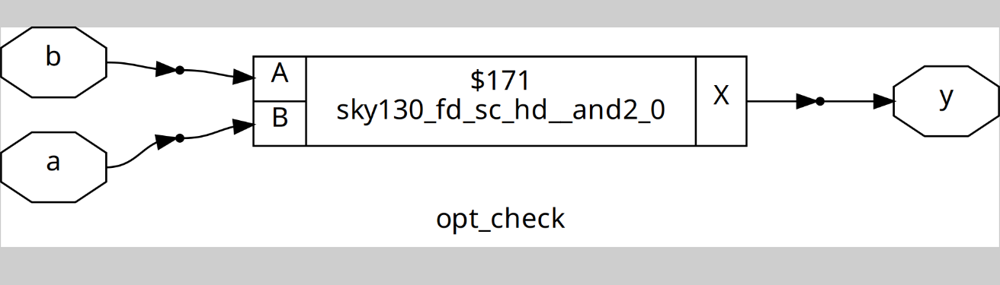
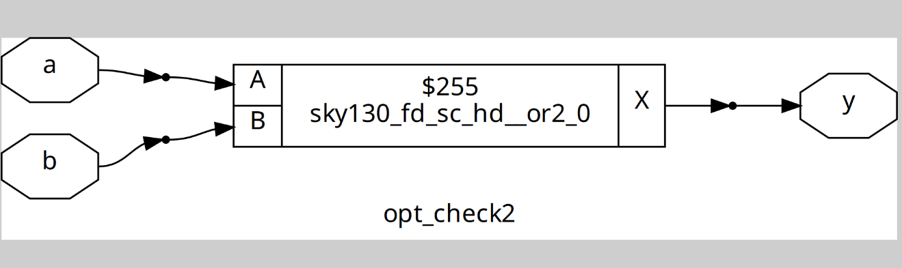
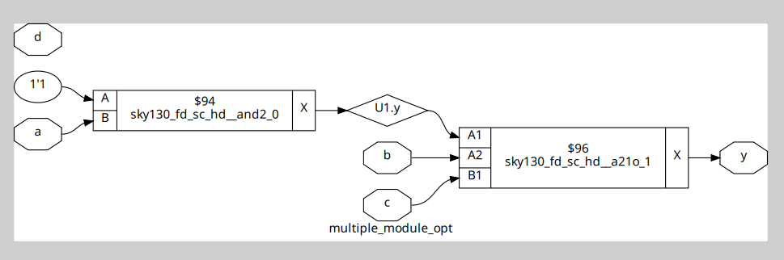
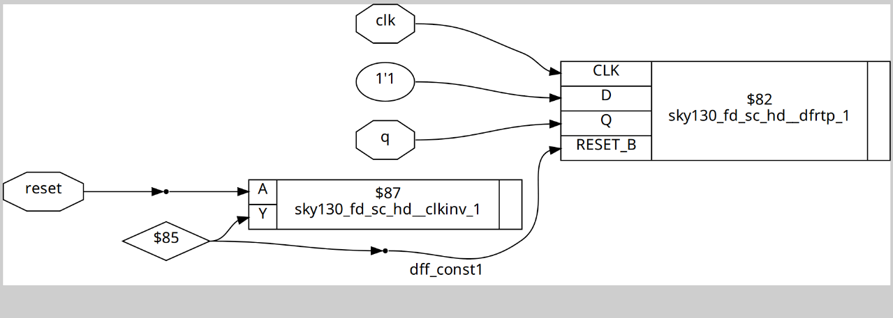
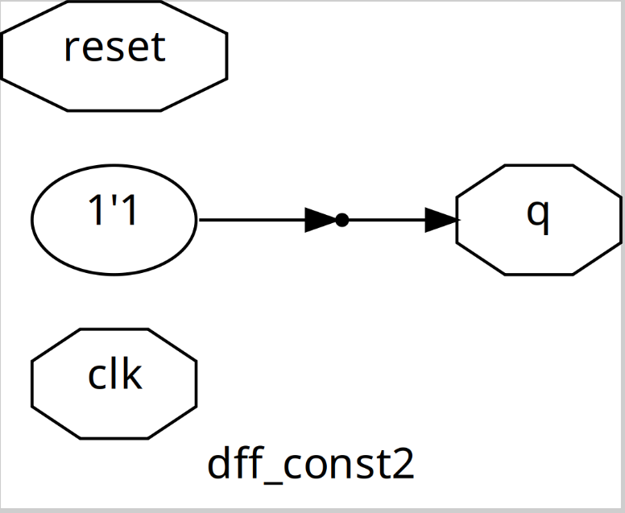

## Design Optimization: Combinational & Sequential Circuits

There are verious techniques to optimize combinational and sequential digital circuits to improve **performance**, **area** and **power efficiency**.

## Constant Propagation

- Replaces variables with constant values during synthesis.
- Simplifies logic and reduces circuit size.
- Improves speed and saves resources.

## State Optimization

- Used for FSMs (Finite State Machines).
- Merges equivalent states to reduce total states.
- Optimizes state encoding for minimal logic.
- Applies Boolean logic to minimize equations.

## Cloning

- Duplicates a logic cell or block to improve performance.
- Balances load, reduces wire delays.
- Helps meet timing closure.

## Retiming

- Shifts flip-flops in a circuit without changing its logic.
- Balances path delays.
- Lowers critical path delay to achieve higher clock speed.
- Maintains functional equivalence.
## Synthesis Flow Example

Use `Yosys` to run optimizations:

```
read_liberty -lib sky130_fd_sc_hd__tt_025C_1v80.lib
read_verilog opt_check.v
synth -top opt_check
opt_clean -purge -------------------// command to do the optimization 
abc -liberty sky130_fd_sc_hd__tt_025C_1v80.lib
```

## Example Labs
# Combinational circuits
```verilog
module opt_check (input a , input b , output y);
  assign y = a ? b : 0;
endmodule
```
In this code, the ternary operator (a ? b : 0) is initially synthesized as a **multiplexer**. However, after optimization, constant propagation simplifies the logic, and the expression is effectively reduced to an **AND gate** (y = a & b).
Synthesis Result :


```verilog
module opt_check2 (input a , input b , output y);
  assign y = a ? 1 : b;
endmodule
```
here also, the ternary operator (a ? 1 : b) is initially synthesized as a **multiplexer**. However, after optimization, constant propagation simplifies the logic, and the expression is effectively reduced to an **OR gate** (y = a | b).



### However, the OR gate is typically implemented as a NAND gate with inverters at its inputs. This is because, in a CMOS configuration, an OR gate requires two stacked PMOS transistors in series, which increases resistance and slows down switching. By using NAND gates and inverters instead, the design avoids stacked PMOS and achieves better performance.

```verilog 
module sub_module1(input a , input b , output y);
 assign y = a & b;
endmodule

module sub_module2(input a , input b , output y);
 assign y = a^b;
endmodule

module multiple_module_opt(input a , input b , input c , input d , output y);
wire n1,n2,n3;
sub_module1 U1 (.a(a) , .b(1'b1) , .y(n1));
sub_module2 U2 (.a(n1), .b(1'b0) , .y(n2));
sub_module2 U3 (.a(b), .b(d) , .y(n3));
assign y = c | (b & n1); 
endmodule
```
here the design is 1st flatten the synthesized.



# Sequential circuits

```verilog
module dff_const1(input clk, input reset, output reg q);
always @(posedge clk, posedge reset)
begin
	if(reset)
		q <= 1'b0;
	else
		q <= 1'b1;
end
endmodule
```
The command used to synthesize sequential circuits is ```dfflibmap -liberty < .lib file name >```. Sometimes, **different .lib** files are available for flip-flops, so this command specifies which library the synthesizer should use for flip-flop mapping.


```verilog
module dff_const2(input clk, input reset, output reg q);
always @(posedge clk, posedge reset)
begin
	if(reset)
		q <= 1'b1;
	else
		q <= 1'b1;
end
endmodule
```
Here the Dff output is always 1 irr of the reset or clk . So it is synthesized without any flip flop.



### During sequential optimization, any unused outputs (outputs that do not contribute to primary outputs or any logic of interest) are typically removed by the synthesis tool. Keeping unused outputs wastes silicon area and power, and can create unnecessary clock loads. Removing them improves the design’s efficiency.