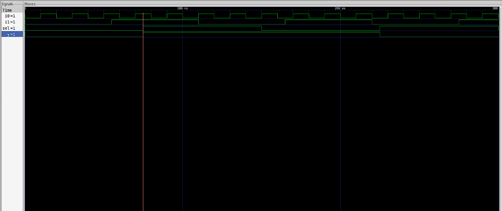
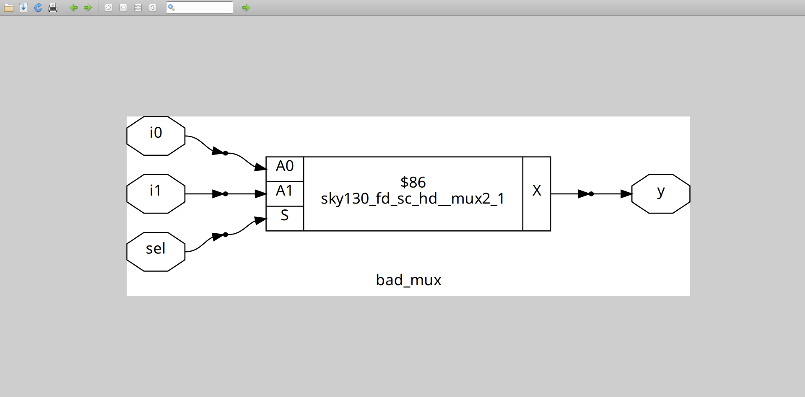
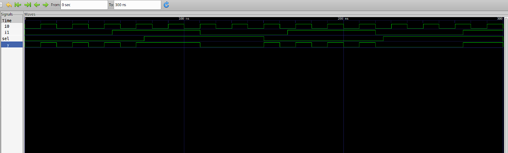
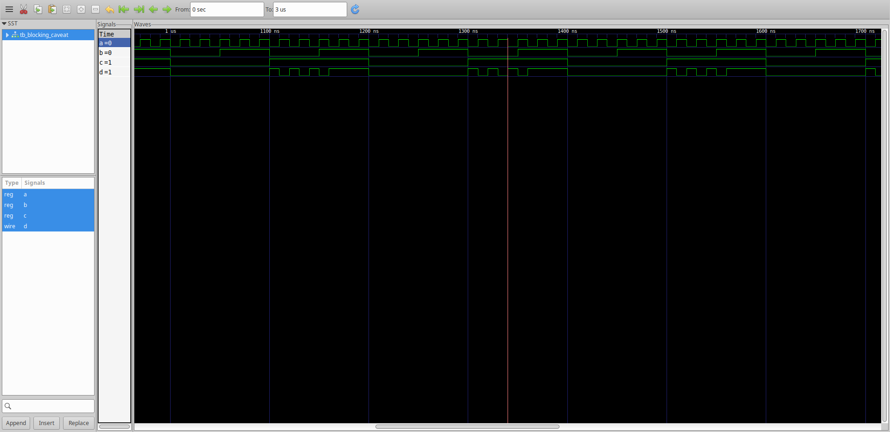
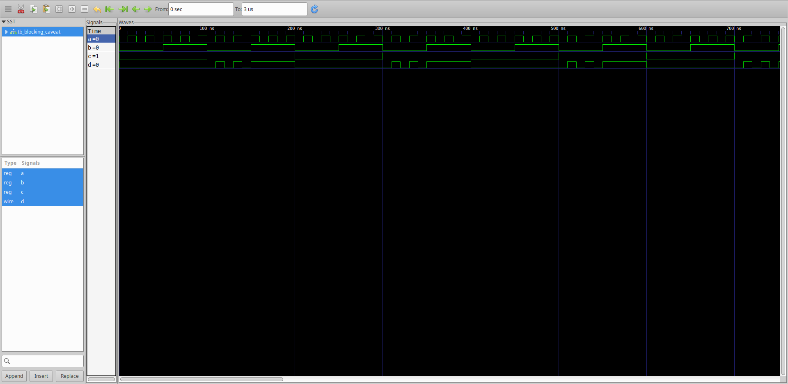

## Gate-Level Simulation (GLS)

**Gate-Level Simulation (GLS)** is an essential step in digital design verification. It ensures that the synthesized netlist works correctly after RTL synthesis.

**Why perform GLS?**

-  **Synthesis Validation:** Verifies that synthesis tools correctly translated RTL to netlist.
-  **Timing Verification:** Checks for timing violations using realistic delays (SDF).
-  **Testability:** Ensures scan chains and other test structures work post-synthesis.

### When to perform GLS?

- **After Synthesis:** When RTL is converted into a gate-level netlist.
- **Before Physical Design:** To catch issues early.

### Types of GLS

- **Functional GLS:** Logic-only simulation (zero/unit delays).
- **Timing GLS:** Uses annotated timing data to check real-world behavior.

## Synthesis-Simulation Mismatch

A **synthesis-simulation mismatch** happens when the RTL simulation results do not match the post-synthesis gate-level simulation .

### Common causes:

-  Non-synthesizable constructs (`initial` blocks, delays).
-  Incomplete/ambiguous RTL (missing `else`, incomplete sensitivity lists).
-  Tool interpretation differences.


### Example : Incomplete sensitivity list :
```verilog
module bad_mux (input i0, input i1, input sel, output reg y);
  always @ (sel) begin
    if (sel)
      y <= i1;
    else 
      y <= i0;
  end
endmodule
```
```verilog
`timescale 1ns / 1ps
module tb_bad_mux;
	reg i0,i1,sel;
	wire y;
	bad_mux uut (
		.sel(sel),
		.i0(i0),
		.i1(i1),
		.y(y)
	);
	initial begin
	$dumpfile("tb_bad_mux.vcd");
	$dumpvars(0,tb_bad_mux);
	sel = 1'b0;
	i0 = 1'b0;
	i1 = 1'b0;
	#300 $finish;
	end
always #75 sel = ~sel;
always #10 i0 = ~i0;
always #55 i1 = ~i1;
endmodule
```
### Simulation  Result :


### Synthesis Result :

### GLS Result :


- The first simulation result is incorrect because the output is evaluated only when ```sel``` changes, which causes a mismatch between simulation and synthesis .
- Also the non-blocking assignments in the combinational circuit might create implied latches which leads to glitches .


## Blocking vs. Non-Blocking Assignments in Verilog

Verilog uses two assignment types:

### Blocking (=)

- Executes immediately, sequentially.
- Used for combinational logic (`always @(*)`).

```verilog
always @(*) y = a & b;
```

### Non-Blocking (<=)

- Executes concurrently, scheduled at end of timestep.
- Used for sequential logic (`always @(posedge clk)`).

```verilog
always @(posedge clk) q <= d;
```

### The order of blocking assignments in a combinational always block is crucial, because blocking assignments execute sequentially in the order written. If the order is incorrect, it can produce wrong simulation results, logic mismatches after synthesis or even unintentional latch inference due to incomplete assignment coverage. 

### Example
```verilog
module blocking_caveat (input a, input b, input c, output reg d);
  reg x;
  always @ (*) begin
    d = x & c;
    x = a | b;
  end
endmodule
```
Simulation Result :

here the order of assignments causes d to use the old value of x not the newly computed value .

Corrected order :
```verilog
always @ (*) begin
  x = a | b;
  d = x & c;
end
```
