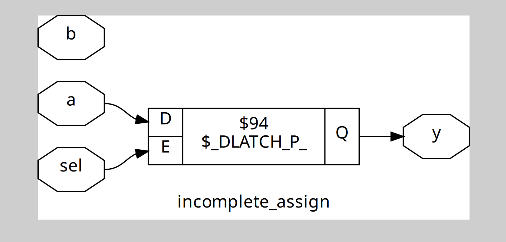
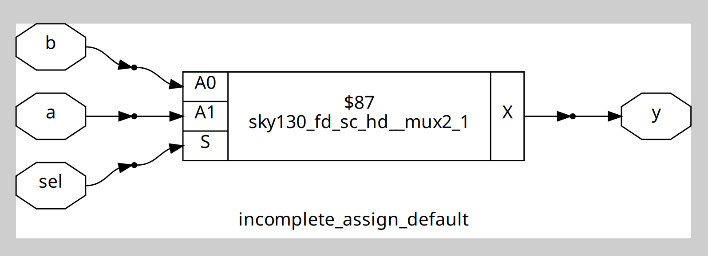
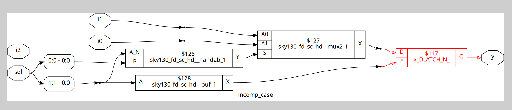
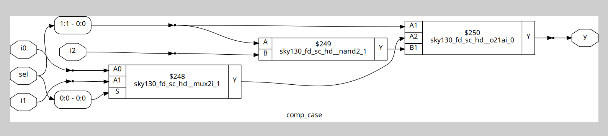
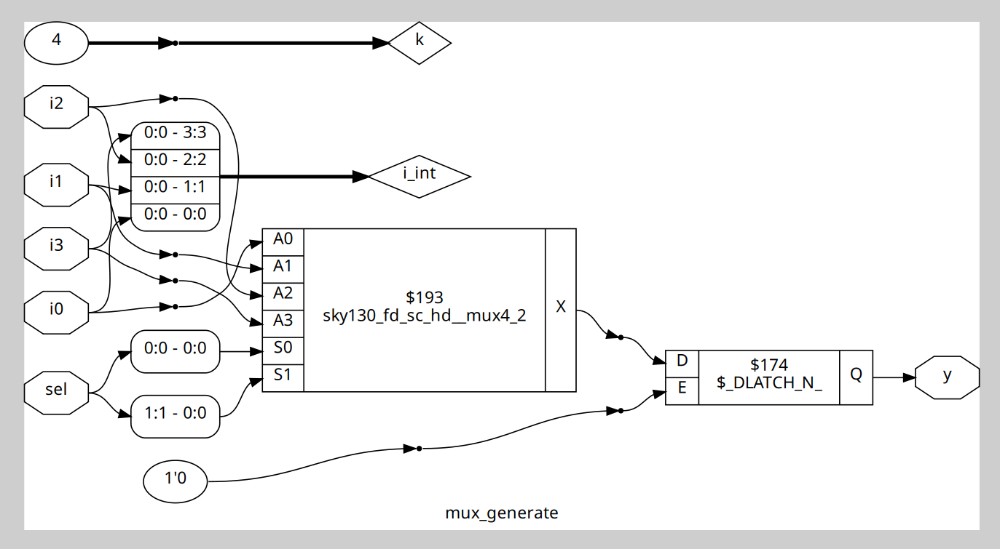
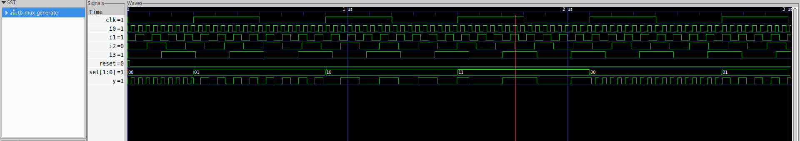

## If-Else Statements in Verilog

If-else statements allow conditional execution inside procedural blocks such as `always` ,  `initial` , tasks or functions.

### Syntax

```verilog
if (condition) begin
    // Code if condition is true
end else begin
    // Code if condition is false
end
```

- `condition` evaluates to true or false.
- `begin ... end` groups multiple statements.
- `else` is optional.

#### Nested If-Else

```verilog
if (condition1) begin
    // Code if condition1 is true
end else if (condition2) begin
    // Code if condition2 is true
end else begin
    // Code if no conditions are true
end
```

## Inferred Latches in Verilog

1. A latch is inferred when a combinational logic block does not assign a variable on all execution paths.

### Example : Incomplete_if

```verilog
module incomplete_assign (
    input wire a, b, sel,
    output reg y
);
    always @(a, b, sel) begin
        if (sel == 1'b1)
            y = a;  
    end
endmodule
```

**Issue:** When `sel` is 0, `y` is not assigned, so a latch is inferred.

### Synthesis Result :


**Solution:** Add an else or default assignment.

```verilog
module incomplete_assign_default (
    input wire a, b, sel,
    output reg y
);
    always @(a, b, sel) begin
        if (sel == 1'b1)
            y = a;  
        else
            y = b;   // Default value when sel is 0
    end
endmodule

```
### Synthesis Result :



## Case Statements in Verilog

`case` statements allow multi-way branching inside procedural blocks such as `always` ,  `initial` , tasks  or functions.

### Syntax :

```verilog
case (expression)
    value1: begin
        // Code if expression == value1
    end
    value2: begin
        // Code if expression == value2
    end
    default: begin
        // Code if no values match
    end
endcase
```

* `expression` is compared to each `value` in order.
* The `default` branch is optional but recommended to avoid latches.

### Example

```verilog
case (sel)
    2'b00: y = a;
    2'b01: y = b;
    2'b10: y = c;
    default: y = d;  // Executes if no other cases match
endcase
```


* Always cover all possible values or include `default` to prevent unintended latches.


### Example 2 : Incomplete_case
```verilog
module incomp_case (input i0 , input i1 , input i2 , input [1:0] sel, output reg y);
always @ (*)
begin
	case(sel)
		2'b00 : y = i0;
		2'b01 : y = i1;
	endcase
end
endmodule
```

**Solution :** Add an default assignment.

```verilog
module comp_case (input i0 , input i1 , input i2 , input [1:0] sel, output reg y);
always @ (*)
begin
	case(sel)
		2'b00 : y = i0;
		2'b01 : y = i1;
		default : y = i2;
	endcase
end
endmodule
```


## For Loops in Verilog

For loops repeat a block of code multiple times inside procedural blocks. The iteration count must be fixed at compile time.

### Syntax :
```verilog
for (initialization; condition; increment) begin
    // Statements
end
```

## Generate Blocks in Verilog

Generate blocks create hardware at compile time. Commonly used for repetitive structures.

### Example : Creating a 4:1 MUX 
```verilog
module mux_generate (input i0 , input i1, input i2 , input i3 , input [1:0] sel  , output reg y);
wire [3:0] i_int;
assign i_int = {i3,i2,i1,i0};
integer k;
always @ (*)
begin
for(k = 0; k < 4; k=k+1) begin
	if(k == sel)
		y = i_int[k];
end
end
endmodule
```
### Synthesis Result :

### Simulation Result :


#### This verifies the correct functionality of the generated multiplexer.